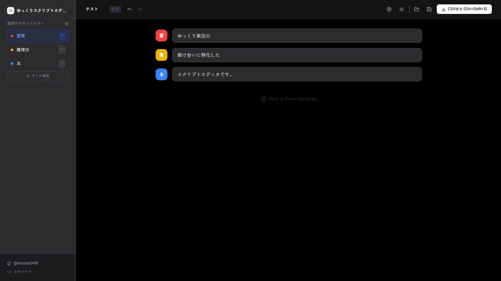

# Yukkuri Script Editor

ゆっくり実況などの台本作成を効率化する、Webブラウザ上で動作するスクリプトエディタです。
思考を止めずにキーボード操作だけで執筆できるよう設計されており、YMM4（ゆっくりムービーメーカー4）互換のCSV出力に対応しています。

[Webサイトへ](https://lineside0418.github.io/YukkuriScri[ptEditor/)

]## 特徴

**キーボード操作に特化**: マウスを使わずに、行追加、削除、キャラクター切り替えが可能。

**YMM4互換CSV出力**: 作成した台本をそのままYMM4の「台本読み込み」で使用できます。

**プロジェクト保存**: 編集状態を独自形式（.json）で保存・復元可能。

**キャラクターカスタマイズ**: 最大9人まで、名前やテーマカラーを自由に設定可能。

**ダークモード対応**: 長時間の作業でも目に優しいダークモードを搭載。

**自動保存**: ブラウザのローカルストレージに自動で保存されるため、誤って閉じても安心。

## 使い方

### 基本操作

**テキスト入力**: テキストボックスにセリフを入力します。

**新しい行を追加**: Ctrl + Enter

**行を削除**: Ctrl + Backspace

**フォーカス移動**: Ctrl + ↑ / ↓

### キャラクター操作

**編集中の行のキャラ変更**: テキストボックスにフォーカスした状態で Ctrl + Alt + ↑ / ↓

**次に追加するキャラの選択**: Ctrl + Alt + 1~9 または Ctrl + Alt + ↑ / ↓ (テキストボックス外フォーカス時)

### その他

**設定**: 右上の歯車アイコンから、ショートカットのカスタマイズやキャラクター設定が行えます。

### 保存

Ctrl + S: プロジェクト保存 (.json)

Ctrl + Shift + S: CSVエクスポート

## 開発者

@lineside0418

[GitHub Profile](https://github.com/lineside0418)

[Repository](https://github.com/lineside0418/YukkuriScriptEditor)

## ライセンス

MIT License